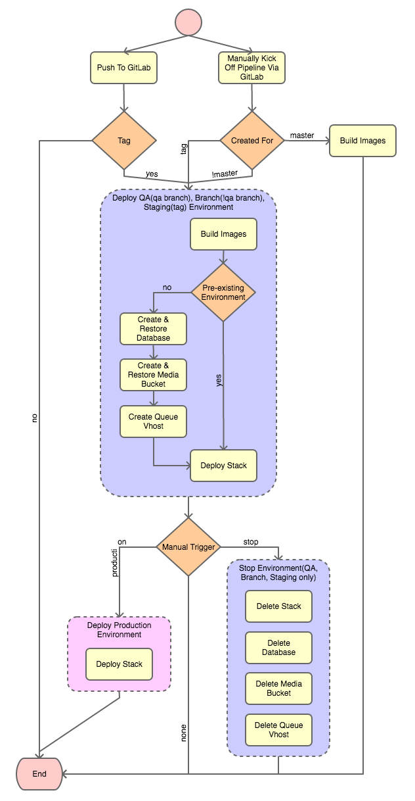

# GitLab Pipeline

This repo implements a general purprose GitLab pipeline which can be utilised to
deploy QA, Branch, Staging and Production environments to Docker Swarm clusters.

## Execution Flowchart

## Usage

To use this pipeline include it as part of any repo's `.gitlab-ci.yml` as follows:

    include: 'https://github.com/unomena/gitlab-pipeline/raw/master/pipeline.yml'
